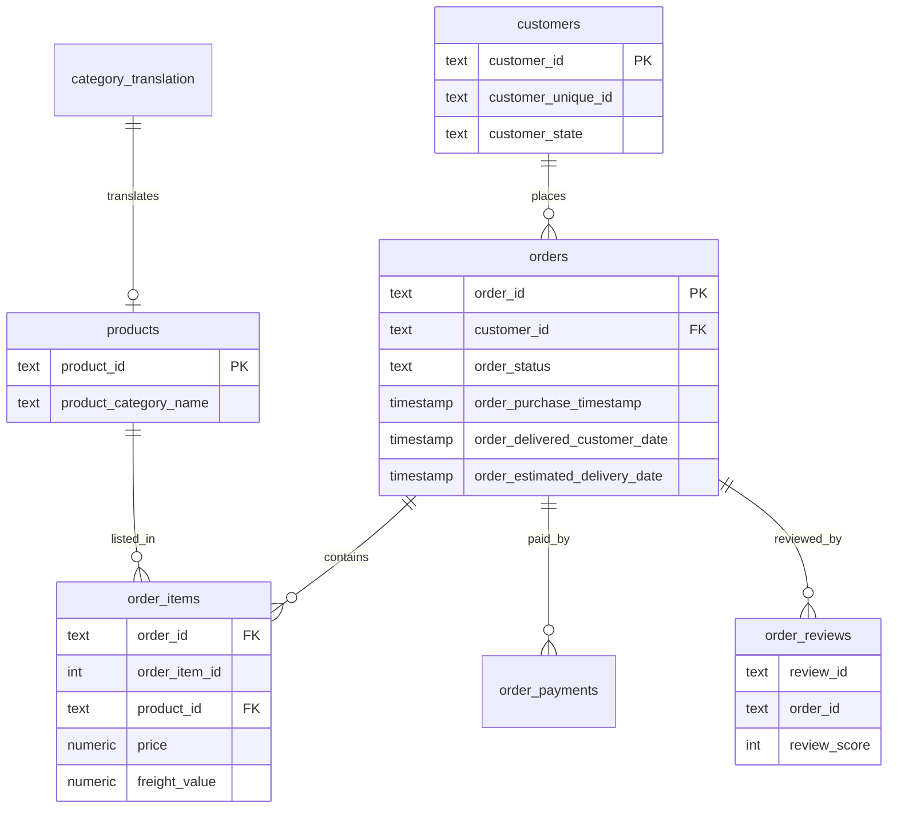

# E-Commerce Sales Analysis (PostgreSQL)

End-to-end SQL analysis of the Olist Brazilian e-commerce dataset: revenue trends,
product categories, customer retention, delivery performance and RFM segmentation.
Built with PostgreSQL and a Python/Plotly notebook for the final visuals.

## Project Overview

This project analyzes ~100K orders from a Brazilian online marketplace to identify
growth opportunities in revenue and customer experience. All metrics are computed
in SQL against a PostgreSQL database; a Jupyter notebook connects to the database
via SQLAlchemy and produces three summary charts.

**Revenue is measured as `SUM(order_items.price)`** (product value, excluding
freight), and only **delivered** orders are included, unless stated otherwise.
Customers are identified by `customer_unique_id`, not `customer_id`.

## Business Questions

1. How do revenue, order count and average order value change month over month?
2. Which product categories, states and cities generate the most revenue?
3. What share of customers make a repeat purchase?
4. How is delivery delay associated with customer review scores?
5. Which customers are most valuable, based on RFM segmentation?
6. What 3–5 recommendations follow from the analysis?

## Dataset

**Source:** [Olist Brazilian E-Commerce Public Dataset (Kaggle)](https://www.kaggle.com/datasets/olistbr/brazilian-ecommerce)

The raw data is not included in this repository.
Download it from the original Kaggle source.

Tables used: `orders`, `order_items`, `order_payments`, `customers`, `products`,
`order_reviews`, plus `product_category_name_translation` for English category names.

## Data Model



## Tech Stack

- **PostgreSQL 18** — database and all analytical queries
- **SQL** — JOINs, CTEs, window functions (`LAG`, `ROW_NUMBER`, `NTILE`, `RANK`),
  `DATE_TRUNC`, `PERCENTILE_CONT`, RFM segmentation, data quality checks
- **Python** — Pandas, SQLAlchemy, Plotly, kaleido (final charts only)
- **DBeaver / psql** — database client
- **Git / GitHub**

## Analysis Highlights

| Metric | Value |
|---|---|
| Total revenue (delivered) | R$ 13,221,498 |
| Delivered orders | 96,478 |
| Unique customers | 93,358 |
| Average order value | R$ 137.04 |
| Repeat purchase rate | 3.00% |
| Late delivery rate | 8.11% |
| Average review score | 4.16 |
| Data period | Sep 2016 – Oct 2018 |

## Key Findings

1. **Growth was driven by acquisition, not retention.** Monthly revenue grew roughly
   9× from R$ 111,798 (Jan 2017) to a peak of ~R$ 977,545 (May 2018), yet 97% of
   customers ordered only once and the repeat purchase rate is just 3.00%.
2. **Average order value is stable (~R$ 124–152)** with ~1.1 items per order, so
   growth came from more orders rather than larger baskets.
3. **Delivery delay is strongly associated with lower ratings:** the average review
   score drops from **4.29** (on-time/early) to **2.57** (late). This is a
   correlation, not proven causation.
4. **Revenue is moderately concentrated:** the top 9 of 70+ categories account for
   ~57% of revenue, led by `health_beauty`, `watches_gifts` and `bed_bath_table`.
5. **Valuable customers are lapsing:** the *At Risk* segment (23.6% of customers)
   historically generated the most revenue (R$ 4.72M) but has not purchased for
   ~392 days on average, while *Champions* (16.5%) generate R$ 4.18M.

## Business Recommendations

Each recommendation follows: **observation → hypothesis → success metric → risk**.

1. **Reactivation program for At Risk customers**
   - Observation: 23.6% of customers generated R$ 4.72M but are inactive ~392 days.
   - Hypothesis: a targeted email/discount campaign can win back a share of them.
   - Success metric: reactivation rate, second-order rate within the segment.
   - Risk: discounts erode margin; some contact data may be stale.

2. **Trigger the second purchase early**
   - Observation: repeat rate is 3%; median time to second purchase is ~29 days.
   - Hypothesis: a welcome series and an offer within the first 30 days lift repeats.
   - Success metric: repeat purchase rate, share of customers with 2+ orders.
   - Risk: correlation ≠ guarantee; validate with an A/B test.

3. **Loyalty program for long-term retention**
   - Observation: 97% of customers buy once; Champions and At Risk are proven valuable.
   - Hypothesis: points/cashback/tiers increase purchase frequency and LTV.
   - Success metric: repeat rate, orders per customer, revenue share from members,
     cohort retention.
   - Risk: program cost may exceed margin gains; pilot and monitor unit economics.

4. **Manage delivery expectations**
   - Observation: late deliveries (8.11%) coincide with ratings dropping to 2.57.
   - Hypothesis: reducing delays in problem categories (`audio`, `food`,
     `home_confort`) raises the average review score.
   - Success metric: late delivery rate, average review score.
   - Risk: causation not proven; other factors (region, category, price) contribute.

5. **Double down on top categories**
   - Observation: the top 9 categories drive ~57% of revenue.
   - Hypothesis: strengthening assortment/promotions in leaders yields the best ROI.
   - Success metric: revenue share, category-level growth.
   - Risk: over-reliance on a narrow set of categories.

## Project Structure

```
sql-ecommerce-sales-analysis/
├── README.md
├── requirements.txt
├── .gitignore
├── data/
│   └── README.md
├── sql/
│   ├── 00_create_schema.sql
│   ├── 01_data_quality_checks.sql
│   ├── 02_monthly_metrics.sql
│   ├── 03_category_revenue.sql
│   ├── 04_repeat_customers.sql
│   ├── 05_delivery_and_reviews.sql
│   ├── 06_rfm_segmentation.sql
│   └── 07_business_summary.sql
├── notebooks/
│   └── ecommerce_sales_analysis.ipynb
├── images/
│   ├── monthly_revenue.png
│   ├── category_revenue.png
│   └── delivery_vs_reviews.png
└── docs/
    └── data_model.md
```

## How to Run

1. Install [Postgres.app](https://postgresapp.com/) (or any PostgreSQL 15+ server)
   and a client such as DBeaver.
2. Create the database and schemas:
   ```sql
   CREATE DATABASE olist_analytics;
   \c olist_analytics
   CREATE SCHEMA raw;
   CREATE SCHEMA analytics;
   ```
3. Download the dataset from Kaggle and place the CSVs in `data/`
   (see `data/README.md`).
4. Run `sql/00_create_schema.sql` to create tables and load data with `\copy`.
5. Run `sql/01` … `sql/07` in order to reproduce the analysis.
6. Set up the Python environment and launch the notebook:
   ```bash
   python3 -m venv venv
   source venv/bin/activate
   pip install -r requirements.txt
   jupyter notebook notebooks/ecommerce_sales_analysis.ipynb
   ```

## Limitations

- Data covers a Brazilian marketplace (2016–2018) and may not generalize.
- The period is bounded; the first months (2016) and last months (2018) are sparse
  or incomplete and are read with caution.
- The analysis is observational and does not establish causation.
  **Correlation does not imply causation.**
- Because 97% of customers ordered only once, the **Frequency** dimension barely
  differentiates the base (avg orders ≈ 1.0 across all segments), so the RFM
  segmentation effectively relies on **Recency** and **Monetary**. This is a
  deliberate simplification reflecting the data.
- `review_id` is not unique (814 duplicates); reviews are aggregated to one score
  per order.
- ~610 products have no category and appear as `unknown`; a few category names keep
  Portuguese spellings absent from the translation table.

## Future Improvements

- Add `sellers` and `geolocation` tables for logistics and regional analysis.
- Build a proper `analytics` layer (views/materialized tables) on top of `raw`.
- Add a seller performance and freight-cost analysis.
- Automate the load with a script instead of manual `\copy`.
