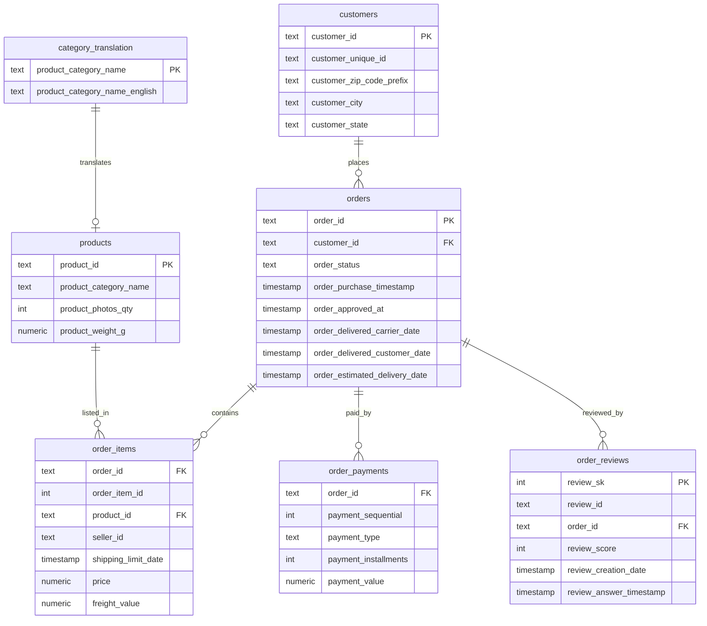

# Data Model

This document describes the data model used in the analysis: the tables, their
key columns, relationships and the analytical decisions applied on top of the
raw Olist dataset.

## Overview

The raw CSVs are loaded into the `raw` schema of the `olist_analytics` database
in PostgreSQL. The analysis queries (`sql/01`–`sql/07`) read from `raw` and
compute metrics on the fly. An `analytics` schema is reserved for a future
curated layer (views / materialized tables).

## Entity-Relationship Diagram

## Tables

### customers
One row per order-level customer record. `customer_id` is unique per order, while
`customer_unique_id` identifies the real person across orders.
**All customer-level analysis uses `customer_unique_id`.**

### orders
One row per order. `order_status` has several values; the analysis focuses on
`delivered` orders (97.02% of all orders). Delivery timeliness is derived from
`order_delivered_customer_date` vs `order_estimated_delivery_date`.

### order_items
One row per item within an order (an order can have several items).
**Revenue is defined as `SUM(price)`** (product value, excluding `freight_value`).
Because an order can have multiple items, items are aggregated to the order level
before joining to `orders` to avoid double counting.

### order_payments
Payment records per order. Not used for the main revenue metric (the project
measures revenue via `order_items.price` by design), kept for reference.

### order_reviews
Customer reviews. `review_id` is **not unique** (814 duplicates), so a surrogate
key `review_sk` is used as the primary key. Reviews are aggregated to one average
score per order before joining.

### products
Product catalog. ~610 products have no `product_category_name`; these appear as
`unknown` in category analysis.

### category_translation
Maps Portuguese category names to English. A few category names in `products`
keep Portuguese spellings that are absent from this table (e.g.
`portateis_cozinha`), a known data limitation.

## Key Analytical Decisions

| Decision | Rule | Reason |
|---|---|---|
| Revenue definition | `SUM(order_items.price)` | Product value, consistent across all steps; excludes freight |
| Order filter | `order_status = 'delivered'` | Only completed sales count toward revenue/experience metrics |
| Customer identity | `customer_unique_id` | `customer_id` is unique per order and overstates the customer count |
| Item aggregation | Sum items per order first | Prevents revenue double counting on multi-item orders |
| Review aggregation | One avg score per order | Handles duplicate `review_id` values |
| RFM reference date | `2018-10-17` (max purchase date) | Data is historical; the current date cannot be used for Recency |

## Data Quality Notes

- Row counts: customers 99,441; orders 99,441; products 32,951;
  order_items 112,650; order_payments 103,886; order_reviews 99,224.
- 814 duplicate `review_id` values (98,410 distinct).
- 610 products without a category.
- 775 orders without items; 1 order without a payment; 9 non-positive payments.
- 0 orders delivered before purchase (no obvious date corruption).
- Data period: 2016-09-04 to 2018-10-17; edge months are sparse/incomplete.
